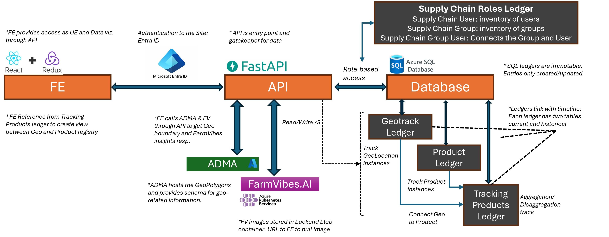

# Quick start (Docker)

Clone this repo to a local folder and run
```bash
    cd foodvibes-ai
    ./scripts/setup/foodvibes/setup_docker.sh
```
and follow prompts to configure and start up the system. For detailed instruction see [SETUP.md](SETUP.md).


<h4>Quick start video</h4>
<video width="600" controls>
  <source src="./Quick-Start.mp4" type="video/mp4">
  Your browser does not support the video tag. Use this instead <a href="./Quick-Start.mp4" target="_video">Quick start video</a>.
</video>


# Introduction

# foodvibes-ai Supply Chain Traceability

## Supply Chain Tracking platform

Supply Chain Tracking platform for the European Union’s Deforestation-free product regulation (EUDR), the FDA’s Food Safety and Modernization Act (FSMA) and other Food Supply Chain Regulations that mandate tracking products together with Geo-location and their relevant compliance insights all the way back to the origin of the product.

## Example

Example to understand the ability to track deforestation and deforestation-free coffee from its origin through multiple transformations.

## Overview

foodvibes-ai provides the building blocks for enabling end-to-end traceability in Supply Chains. It was built with the aim of supporting sustainability goals in the Food Supply Chain but can be adapted for other global supply chains too. foodvibes-ai tracks the products through the supply chain along with time and location which enables a better lifecycle assessment to reduce wastage, track carbon footprint and meet regulations.

## Features

The features that foodvibes-ai enables are:

- **Trusted information tracking through immutable ledgers:** The database is built on top of immutable ledgers. While keeping things simple, the ledger framework provides a layer of immutability that prevents data manipulation.
- **3W tracking:** foodvibes-ai tracks the When, What and Where of the products. This is done through three ledgers.
  - First the GeoTrack Ledger, which is a registry of all known GeoLocations registered by Supply chain stake holders.
  - Second is the Product Ledger, which is a registry of new instances of products.
  - Lastly the Tracking Products Ledgers, which connects the dots across time and space. It tracks the transformation of products from the previous steps to current steps (i.e aggregation/disaggregation/transformation) and it tracks movement of products from one location to the next. These create associations across geoTrack and Product Ledger instances.
- **Role-based information access:** foodvibes-ai also defines a preliminary role-based access approach. It is understood that not all information is visible to every supply chain entity. Data Visibility is indicated by the roles and their association with other stakeholder users. This is further limited by the product level association through Product Tracking Ledger.
- **Geo-location and related information tracking:** foodvibes-ai provides a means to connect Geotrack ledger entries with location coordinates, geopolygons and location-indexed information that can be defined for each entity in tools like the Azure Data Manager for Agriculture (ADMA). This provides a means to not only track the product, but also its relevant information from each location and time (like storage temperature, certifications) along with it.
- **Remote sensing insights:** It also connects with FarmVibes.ai, which is an opensourced satellite-based geospatial insight generation tool. This is helpful for gaining macro insights associated with locations that the product travels through. We demonstrate the example of analyzing deforestation at supply chain locations through satellite-based maps. A few other examples include understanding the weather during harvest, rainfall, built environment and land degradation associated with the supply chain locations. These insights can also help with risk assessment.

<div style="background-color: white; padding: 10px;">
  <h3>Example use of FoodVibes with the EUDR to enable geolocation and time tracking with products to identify deforestation-free coffee</h3>
  
</div>
<div style="background-color: white; padding: 10px;">
  <h3>FoodVibes architecture showcasing the options to connect with ADMA for geolocation and information tracking and connection to FarmVibes.ai for geolocation based remote sensing insights</h3>
  
</div>


## Roles & Permissions

For an overview of Roles & Permissions in foodvibes-ai, see [ROLES_PERMISSION.md](ROLES_PERMISSIONS.md).

## Disclaimers

<p>
This project welcomes contributions and suggestions. Most contributions require you to agree to a Contributor License Agreement (CLA) declaring that you have the right to, and actually do, grant us the rights to use your contribution. For details, visit <a href="https://cla.opensource.microsoft.com">https://cla.opensource.microsoft.com</a>.
</p>

<p>
When you submit a pull request, a CLA bot will automatically determine whether you need to provide a CLA and decorate the PR appropriately (e.g., status check, comment). Simply follow the instructions provided by the bot. You will only need to do this once across all repos using our CLA.
</p>

<p>
This project has adopted the <a href="https://opensource.microsoft.com/codeofconduct/">Microsoft Open Source Code of Conduct</a>. For more information see the <a href="https://opensource.microsoft.com/codeofconduct/faq/">Code of Conduct FAQ</a> or contact <a href="mailto:opencode@microsoft.com">opencode@microsoft.com</a> with any additional questions or comments.
</p>

</p>
<b>Trademarks</b><br>
This project may contain trademarks or logos for projects, products, or services. Authorized use of Microsoft trademarks or logos is subject to and must follow <a href="https://www.microsoft.com/en-us/legal/intellectualproperty/trademarks/usage/general">Microsoft's Trademark & Brand Guidelines</a>. Use of Microsoft trademarks or logos in modified versions of this project must not cause confusion or imply Microsoft sponsorship. Any use of third-party trademarks or logos are subject to those third-party's policies.
</p>
<pre>
--
Change log:
Feb. 28, 2024 -- C. Kasra v-cyruskasra@microsoft.com -- Initial release
Mar. 1, 2024 -- C. Kasra -- Addition of FastAPI to make dabase schema accessible for CRUD operations
Mar. 23, 2024 -- C. Kasra -- Addition of support for recorded_at and is_history columns
Aug. 9, 2024 -- C. Kasra -- Addition of Open Source Software setup scripts
Aug. 16, 2024 -- C. Kasra -- Incorporated information from Bruno Silva regarding enhancements including links and additional libraries and tools installations
Sep. 12, 2024 -- C. Kasra -- Moved setup details to SETUP.md
Oct. 15, 2024 -- C. Kasra -- Added disclaimers and images to README.md
</pre>